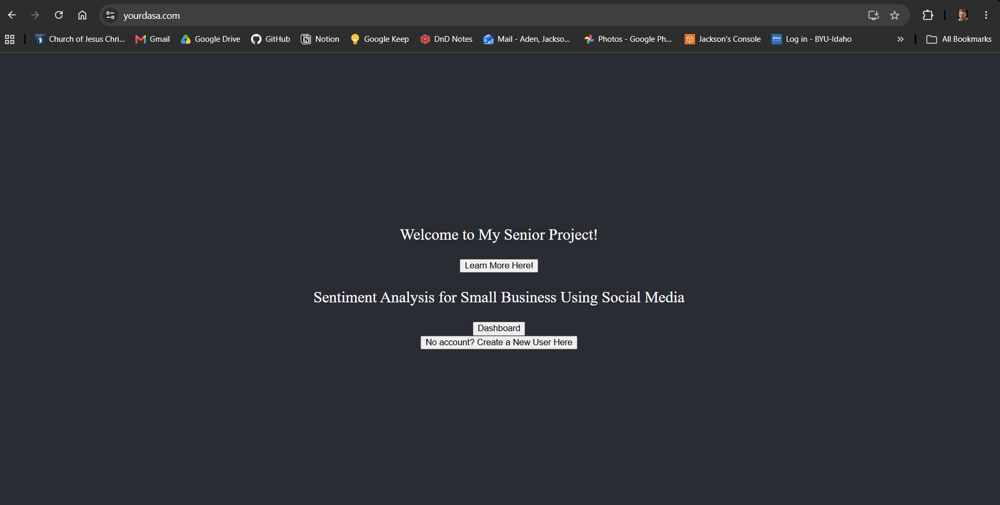
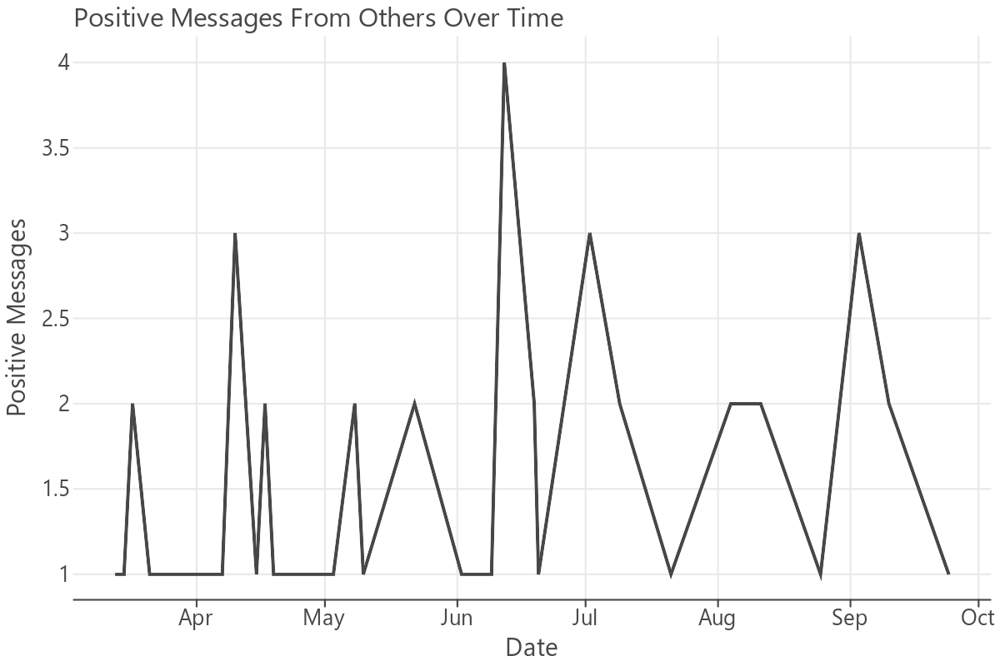

### What is yourdasa?

{width=70%}

Small businesses on social media are often run by students or parents who are incredibly busy with other things in their lives. 
We know that bigger businesses have whole teams of data analysts to help the CEO make decisions. Small businesses don’t have the 
resources to do anything even similar. DASA is where we find the solution. DASA stands for 
Data Analysis Super Assistant. It breaks down your JSON data from Instagram and helps you understand the overall 
sentiment toward your product, showing graphs just like a data analyst would. 

## How does this have anything to do with Machine Learning?

[yourdasa.com](https://yourdasa.com) is a publicly accessible website, built from the ground up, full stack in 6 months.
Small businesses that have an Instagram businesses page can download a json file of every DM. There are machine learning models
on [HuggingFace](https://huggingface.co/) that accept statements, and return a sentiment. One of these models is [bertweet-base-sentiment-analysis](https://huggingface.co/finiteautomata/bertweet-base-sentiment-analysis),
designed to output sentiment scores. These sentiment scores can be output as graphs!

{width=70%}

These ML models run on a Linux server, and are handled by endpoints in a Flask application. The graphs are generated using ggplot, a library
used in both python and R! The Machine Learning model is opensource and fantastic!